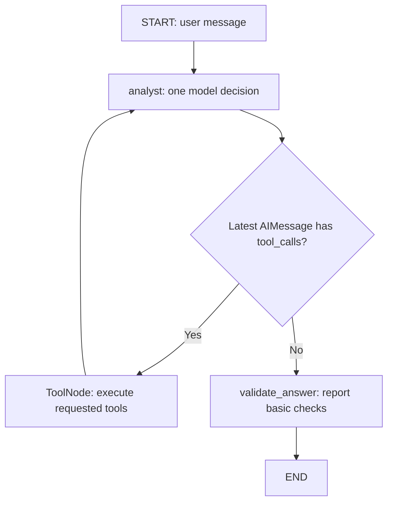

# How this analyst agent is built / 从零件到 Agent Loop

Read this alongside [the executed notebook](research_data_analyst.ipynb).
The [review](REVIEW.md) evaluates correctness; these notes explain construction.
The goal is to explain each step yourself, not just run a finished project.

## 1. Start from the question and the responsibility boundary

Our question has two kinds of work: “What do the numbers show?” and “What might
explain the difference?” CSV lookup and arithmetic have exact rules. Choosing
which information to request and composing a useful interpretation require
judgment. That is why this project combines a model with deterministic code.

| Work | Owner in this project | Your earlier example |
|---|---|---|
| Make capabilities available | `@tool` and model binding | `1_Langchain/main_v1.py`; basic chatbot's tools section |
| Retrieve evidence | Python CSV tools and Tavily | RAG retrieval → evidence → generation |
| Decide the next capability to use | Analyst LLM | `bind_tools()` in `3_LangGraph/1_basicchatbot.ipynb` |
| Preserve the conversation | State + message reducer | `TypedDict`, `Annotated`, `add_messages` |
| Execute requested functions | `ToolNode` | Basic chatbot's tool and ReAct sections |
| Return to the model after execution | Graph edge | `tools → tool_calling_llm` |
| Remember a follow-up | Checkpointer + thread ID | Your memory and HITL examples |
| Check basic answer properties | Python validator | This exercise's hybrid workflow addition |

LangGraph does not choose “Germany” or write the search query. It supplies the
execution structure. The LLM chooses actions within that structure. 不要把
“Graph 决定下一节点”与“模型决定下一次调用哪个工具”混为一谈。

## 2. First build ordinary data functions

Open [analyst_tools.py](analyst_tools.py). The CSV is loaded into `DATA`, a list
of dictionaries, at module import time. `lookup()` normalizes country aliases
and looks for one matching country/year. `metric_error()` checks the allowlist.
These helpers have no model dependency and are not individually exposed as tools.

```python
canonical = ALIASES.get(country.strip().lower(), country.strip())
for row in DATA:
    if row["country"] == canonical and row["year"] == year:
        return dict(row)
```

For six rows this is enough. Exact country/year matching does not need embeddings,
FAISS or RAG. In folder 2 you retrieved relevant document passages; here you retrieve
exact records. Both give the model evidence, but the retrieval method is different.

The CSV is illustrative. A model cannot make it official by searching for a
similar number. Also, `DATA` is an in-memory snapshot: editing the CSV after this
module is loaded does not automatically refresh it. Restart the process/kernel or
reload the module when experimenting with changed data.

## 3. Turn four capabilities into tools

The `@tool` decorator wraps a Python function with a tool name, description and
argument schema. Type annotations describe arguments; the docstring tells the
model when and why to use the capability. Runtime schema validation and the
function's semantic checks are separate layers.

| Tool | Model supplies | Python returns / owns |
|---|---|---|
| `get_country_data` | Country and year | One row or an availability error |
| `compare_metric` | Countries, metric, year | Values, ascending ranking, highest/lowest, spread |
| `calculate_change` | Country, metric, two years | Start, end, end-minus-start change |
| `web_search` | A search query | External titles, URLs and snippets, or an error |

For example, the model chooses `metric="inflation"`; Python verifies that this
column is allowed. Python calculates `3.0 - 4.1` and returns `-1.1` percentage
points. The model explains that this is a decrease. It does not need to calculate
the difference again.

Run this in the notebook after its setup cell:

```python
get_country_data.invoke({"country": "US", "year": 2024})
calculate_change.invoke({
    "country": "US", "metric": "inflation",
    "start_year": 2023, "end_year": 2024,
})
```

These are **direct executions**, not agent decisions. This is the first useful
boundary to observe: 工具能独立运行，然后才接入 Agent。

## 4. Give the model schemas with bind_tools

In [analyst_graph.py](analyst_graph.py):

```python
bound_model = model.bind_tools(TOOLS)
```

This prepares a model call that includes tool definitions. It does not run
`get_country_data`, open the CSV again, or call Tavily. The model can respond with
ordinary text or with structured tool calls such as:

```python
AIMessage(
    content="",
    tool_calls=[{
        "name": "get_country_data",
        "args": {"country": "US", "year": 2024},
        "id": "example-call-id",
    }],
)
```

The example ID above is illustrative. Notebook section 7 shows the actual saved
call. The model chooses the name and arguments; the registered tool/schema limits
what can be dispatched and validates how arguments are supplied.

Three concepts to keep separate:

1. **Tool definition:** a function, schema and description exist.
2. **Tool calling:** the model requests that capability with arguments.
3. **Tool execution:** Python actually runs the requested function.

`bind_tools()` is step 2's preparation, not step 3.

## 5. Define the shared state and its update rules

```python
class State(TypedDict):
    messages: Annotated[list[BaseMessage], add_messages]
    tool_calls_used: int
    validation: dict
```

`TypedDict` describes a dictionary's expected shape; it is not a class instance
with automatic runtime validation of every field. LangGraph uses the schema to
define state channels. Nodes can return a partial update, so the initial input
can contain just `messages`; the diagnostic fields appear when nodes write them.

For `messages`, `add_messages` merges new messages into history, appending new
IDs and replacing existing messages with matching IDs. It also understands
supported message representations. The other two fields have the default
replacement behavior. The reducer distinction follows the
[official Graph API documentation](https://docs.langchain.com/oss/python/langgraph/graph-api).

```python
# A node returns the NEW message, not the entire old history again.
return {"messages": [response]}
```

Conceptually, the evolving history is:

```text
HumanMessage: the question
AIMessage: one or more tool requests
ToolMessage: one matching result per request
AIMessage: another request, or final answer
...
```

The static `SYSTEM_PROMPT` is added when calling the model. It is not repeatedly
stored as a new entry in `state["messages"]`. Keep static rules and dynamic
conversation state conceptually separate.

## 6. Build the analyst node

The central line is:

```python
response = bound_model.invoke([
    SystemMessage(content=SYSTEM_PROMPT),
    *state["messages"],
])
```

`*state["messages"]` expands the current list into the model input after the
system message. The model can see prior tool results because they are messages
in that list. The node returns a new AI message and the diagnostic call count.

The node is defined inside `build_graph()`, so it closes over `model`,
`bound_model` and `max_tool_calls`. You do not need to put those objects in state.
The node function handles one model decision; the graph makes repeated decisions
possible by returning to the same node.

Prompt rules such as “be concise,” “use evidence” and “search after retrieving
data” guide behavior. They are not deterministic gates. The saved long answer
and historical-period mismatch show why that distinction matters.

## 7. Add ToolNode and the return edge

```python
builder.add_node("tools", ToolNode(TOOLS))
builder.add_edge("tools", "analyst")
```

`ToolNode` reads the last AI message's tool calls, finds registered tools, invokes
them and supplies matching `ToolMessage`s. A tool call's `id` and its result's
`tool_call_id` connect a request to its result. Notebook section 9 verifies that
relationship using saved live messages.

Multiple calls can occur in one AI message and can be executed in parallel by
the synchronous ToolNode. A single `tools` update can therefore contain several
results. The model makes its next decision after that node returns. The list
order is not proof that one tool used another tool's result.

The return edge is what your one-shot tool example lacked:

```text
tools → END       stops at the result
tools → analyst   lets the model observe and decide again
```

ReAct-style behavior comes from repeatedly combining model decisions with
observed tool results. The visible trace shows actions and evidence, not the
model's private reasoning.

## 8. Route tool requests and ordinary answers differently

The actual graph is assembled with:

```python
builder = StateGraph(State)
builder.add_node("analyst", analyst)
builder.add_node("tools", ToolNode(TOOLS))
builder.add_node("validate_answer", validate_answer)
builder.add_edge(START, "analyst")
builder.add_conditional_edges(
    "analyst", tools_condition,
    {"tools": "tools", END: "validate_answer"},
)
builder.add_edge("tools", "analyst")
builder.add_edge("validate_answer", END)
```

This excerpt belongs inside `build_graph()` after its node functions are defined;
it is not a standalone notebook cell.



`tools_condition` checks the message structure. It does not evaluate whether the
evidence is sufficient or whether the answer is correct. No calls means the model
has stopped requesting tools; the graph follows the no-tool branch.

The explicit mapping sends the router's `END` result to `validate_answer`.
Otherwise the default router could end before validation. `compile()` then creates
the runnable graph; it does not run the user question or train the model.

## 9. Read the real saved run correctly

In `results/live_runs.json`, the `agentic` case has this sequence:

| Event | Node | What actually happens |
|---|---|---|
| 1 | analyst | Requests US, Germany and Japan rows **and** a GDP comparison in one batch |
| 2 | tools | Returns four matching tool results; comparison ranks Germany lowest |
| 3 | analyst | After seeing those results, requests a Germany-2024 explanation search |
| 4 | tools | Returns Tavily titles, URLs and snippets |
| 5 | analyst | Returns an ordinary final answer with no tool calls |
| 6 | validate_answer | Reports the limited checks, then ends |

There are **three model decisions**, **two ToolNode visits**, and **five tool
calls**. Counting these separately helps explain both execution and cost.

The model did not first observe three row results and then request the comparison:
the comparison was already requested in event 1. The genuinely subsequent choice
is the web search after event 2. This corrects the wording in the older run report.

The following notebook code inspects every batch, including arguments:

```python
for event in runs["agentic"]["events"]:
    for node, update in event.items():
        for message in update.get("messages", []):
            if message.get("tool_calls"):
                print(node, message["tool_calls"])
```

`stream_mode="updates"` reports a node's changes, while `"values"` reports the
accumulated state. Neither automatically means token-by-token text streaming.
That is a different stream mode/interface. See the
[official streaming documentation](https://docs.langchain.com/oss/python/langgraph/streaming).

## 10. Understand budgets, memory and validation as separate controls

### Tool-call budget

`current_turn()` finds the latest `HumanMessage`. The analyst counts tool calls
requested since that message. A batch of four counts as four, not one. The code
rejects an entire proposed batch that would exceed the remaining budget.

Once the budget is reached, the node calls the **unbound** model to request a
final answer from existing evidence. The configured `recursion_limit=24` provides
a separate graph-step bound. A tool budget is not a wall-clock timeout or an
overall API spending cap. The OpenAI model also has its own request timeout/retry
configuration.

`tool_calls_used` is calculated from requests recorded in AI messages; it is not
a log of successful tool executions. Failed attempts can still consume budget.

### Checkpoint memory

```python
graph = builder.compile(checkpointer=InMemorySaver())
config = {"configurable": {"thread_id": "analyst-session-1"}}
```

Within one process, subsequent inputs using the same graph/checkpointer and
thread ID continue the conversation. The model sees earlier messages and can
resolve “which one” and “that year.” Send only the new human message for the
next turn; do not resend the whole history with fresh IDs.

Memory is state persistence, not model training. A thread ID is a lookup key,
not durable storage by itself. Starting a new process with a new `InMemorySaver`
loses the previous session. The CLI's full suite demonstrates memory internally;
running the CLI twice does not continue the old in-memory conversation.

### Final validation

The validator checks minimum length, practice-data labeling when current-turn
CSV results exist, and presence of at least one returned URL when current-turn
search results exist. It leaves the final AI message unchanged.

It does not prove numeric correctness, source agreement, historical period,
causality or completeness. In this version it also does not prevent a failed
answer being returned. Review findings R6 and R7 show the cross-turn evidence
gap and the CLI's success exit after a failed check.

因此，`validation.passed=True` 的准确含义是“这些有限检查通过了”，不是
“这个分析已经被验证为正确”。

## 11. Distinguish three kinds of execution evidence

| Evidence | What it establishes | What it does not establish |
|---|---|---|
| Direct `.invoke()` on a tool | Function returns expected data/errors | That a model chooses or understands that tool |
| Offline `ScriptedModel` + real graph | Reducers, routing, ToolNode and budget protocol work | Real model reasoning or adaptation |
| Saved live OpenAI/Tavily run | The recorded model choices and outputs occurred | All possible prompts/models/failures will behave the same |

A domain error returned as `{"error": ...}` is data. Unless special handling is
added, its `ToolMessage` can still have the transport status `success`: the
function executed and returned an error-shaped result. A raised invocation or
service exception follows a different handling path. Inspect content as well
as status when reviewing failures.

The current live China question demonstrates recognition of an unavailable scope
without a tool call. The offline error test demonstrates the error-message route.
It does not show a live model adapting after an executed failure.

Also, the local wrapper does not catch every exception, but the installed Tavily
tool internally converts some exceptions to error results. Understand error handling
across the whole call chain, not only the outer function.

## 12. Learn from the research output, not just its citations

The saved `research` answer uses a 2025 source passage about tariffs and exports
while answering about 2024. A URL containing useful economic information is not
enough: the supporting passage must apply to the claim's period and scope.

For each explanation, identify:

1. The exact claim in the final answer.
2. The tool result and source that support it.
3. The period discussed by that passage, distinct from its publication date.
4. Whether the passage is an observation, forecast or interpretation.
5. Whether it supports causality or only a possible explanation.

A report published in January 2025 can discuss 2024 correctly. A paragraph about
2025 cannot automatically explain 2024. Your practice CSV and a later revised
statistical series can also disagree without either being an appropriate verified
dataset for this exercise. Review R5 records the specific output issue.

## 13. Reconstruct the build in the original learning order

Use the existing notebook and code as checkpoints:

1. Inspect the dataset and predict one lookup result.
2. Invoke each tool directly; explain input schema versus semantic allowlist.
3. Inspect one real AI tool-call message; identify name, arguments and ID.
4. Inspect State; predict how one node update changes message history.
5. Read the analyst node; identify static prompt and dynamic state input.
6. Read ToolNode's role; match each result to its request ID.
7. Trace the conditional edge and `tools → analyst` loop.
8. Count decisions, ToolNode visits and calls in the saved worst-performer case.
9. Trace the memory follow-up; explain where the country/year reference comes from.
10. Read a validator result and state exactly what it does and does not establish.

After that, this interview answer should refer to concrete code:

> I used Python for exact data access, calculations and execution constraints.
> The LLM selected tools and arguments, observed the results, and chose a follow-up
> search before synthesizing an answer. LangGraph preserved message state and
> controlled the loop between the model, ToolNode and a deterministic validator.

自测：如果删除 `tools → analyst`，会失去哪一步？如果删除 `add_messages`，
模型下一轮还能看到什么？为什么同一次 AIMessage 的多个 tool calls 不代表
多轮观察？为什么只有一个 URL 的答案也可能是错的？

Answers: the model would lose the opportunity to observe and synthesize after
execution; default replacement would lose previous message history; the batch
was chosen before its results arrived; citations do not by themselves establish
support, historical relevance or correctness.
