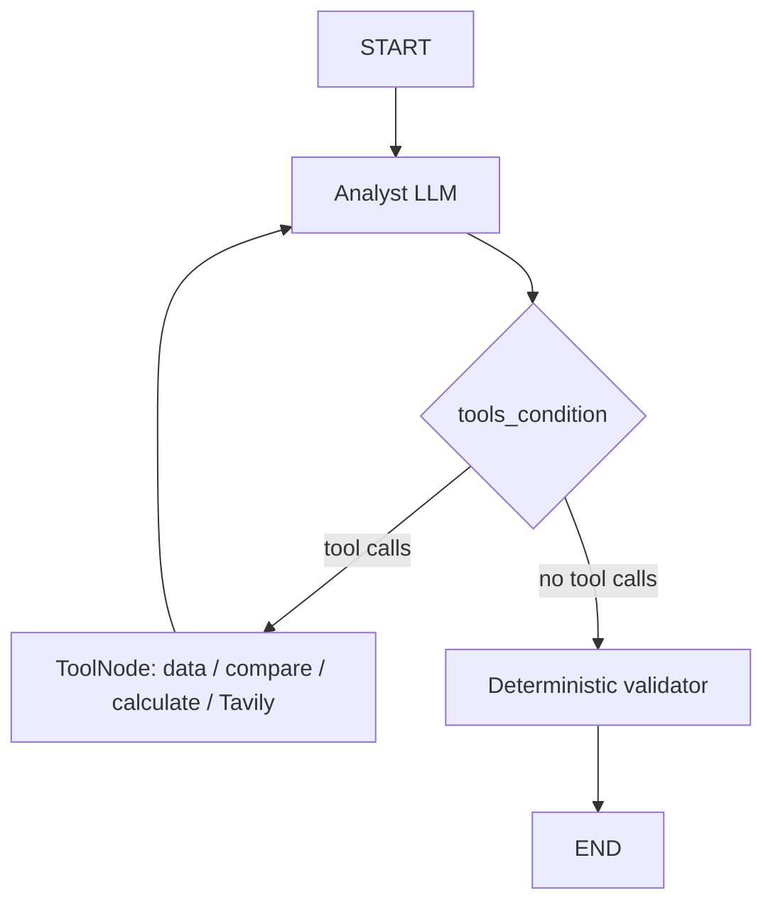

# Research / Data Analyst Agent — Week 7 integration

Start with `REPOSITORY_REVIEW.md`, then open `research_data_analyst.ipynb`.
Read `LEARNING_NOTES.md` for a step-by-step explanation of how the agent is built,
and `REVIEW.md` for the implementation/output review. The notebook connects this
exercise to your earlier code and includes executed outputs plus inline build notes. `original_plan.txt` preserves your supplied plan.

## Architecture and responsibility boundary



The LLM understands the question, selects tools and arguments, decides whether
more research is needed, and synthesizes evidence. Python retrieves values,
computes changes/rankings/spreads, validates inputs, executes tools and enforces
the call budget. `bind_tools()` supplies schemas; `ToolNode` executes calls and
returns `ToolMessage`s. `add_messages` merges them into state for the next decision.

**The CSV is illustrative practice data, not official macroeconomic statistics.**
Web search supplies real-world context, not validation of the CSV. Change and
spread units are percentage points. No RAG, MCP, multi-agent, frontend or deployment.

## Run from the repository root

The root `.venv` currently points to a missing interpreter. An isolated environment
is provided under this folder. To recreate it on another machine:

```sh
uv venv 4_Exercise/.venv --python python3
uv pip install --python 4_Exercise/.venv/bin/python -r 4_Exercise/requirements.txt
```

Set `OPENAI_API_KEY` and `TAVILY_API_KEY` in the root `.env` or
`4_Exercise/.env`. Use `.env.example` as the field reference; keys are never copied
into saved results. Optional `OPENAI_MODEL` defaults to `gpt-4.1-mini`.
The folder-specific `.env` takes precedence over root values; existing process
environment variables take precedence over both.

```sh
# No API calls: numerical tools, errors, ToolNode loop, budget and validator checks
4_Exercise/.venv/bin/python 4_Exercise/test_exercise.py

# Live API calls: five planned cases + unavailable data + two-turn memory
4_Exercise/.venv/bin/python 4_Exercise/run_exercise.py

# One custom live question
4_Exercise/.venv/bin/python 4_Exercise/run_exercise.py --query "How much did US inflation change from 2023 to 2024?"

# Register a notebook kernel, then select it in your notebook editor
4_Exercise/.venv/bin/python -m ipykernel install --user --name llm-learning-exercise --display-name "LLM Learning — Exercise"
```

Live runs use your configured APIs and their normal billing. Full-suite reruns
replace `results/live_runs.json`; custom runs replace `results/custom_run.json`.
The notebook reads the saved suite by default and has an optional live-run switch.

## Files

| File | Purpose |
|---|---|
| `LEARNING_NOTES.md` | Construction walkthrough, actual trace interpretation and self-checks |
| `REVIEW.md` | Three-layer review with severity-labeled findings |
| `results/review_checks.json` | Offline reproduction evidence for review findings |
| `analyst_tools.py` | Four tool schemas, CSV lookup, calculation and Tavily search |
| `analyst_graph.py` | State, prompt, model binding, ToolNode loop, budget and validator |
| `run_exercise.py` | Streaming CLI and evidence capture |
| `test_exercise.py` | Offline deterministic and graph-protocol checks |
| `research_data_analyst.ipynb` | Guided learning walkthrough with outputs |
| `data/macro_data.csv` | Six illustrative rows from your plan |
| `results/live_runs.json` | Real model decisions, tool outputs, answers and validation |
| `results/RUN_REPORT.md` | Observed paths and execution findings |
| `results/offline_tests.txt` | Offline test output |
| `results/requirements.lock.txt` | Exact installed versions used for this run |
| `architecture.mmd` | Mermaid generated by the compiled graph |

## Four-hour learning route

| Time | Activity | What to observe |
|---|---|---|
| 0:00–0:20 | Read review, scope and dataset | Why exact retrieval does not need vectors |
| 0:20–0:55 | Read/edit the four tools | Type annotations and docstrings become schemas |
| 0:55–1:15 | Invoke tools independently | Python returns values and recoverable errors |
| 1:15–1:40 | Inspect State and model binding | Messages are merged; binding does not run tools |
| 1:40–2:05 | Inspect nodes and edges | `tools → analyst` enables another decision |
| 2:05–2:30 | Read streamed events / rerun cases | Tool call → ToolMessage → next model decision |
| 2:30–3:00 | Experiment with prompt | Evidence use and stopping behavior |
| 3:00–3:25 | Inspect guards and errors | Deterministic logic surrounds agent decisions |
| 3:25–3:45 | Inspect two-turn memory | Same thread preserves context; new process loses it |
| 3:45–4:00 | Answer notebook review questions | Explain the architecture using actual traces |

## Limits

Validation checks length, practice-data labeling and whether a returned URL is
present when search produced URLs. It reports issues; it does not certify each
claim or guarantee valid causal reasoning. A search failure or missing dataset
must remain a limitation. Tool schemas reject malformed arguments; missing rows
and metrics return structured errors. Unexpected exceptions remain visible.
Memory is process-local. The exercise bounds each turn to eight tool calls and
24 graph steps; production retry policies, durable memory and full evaluation
are future work.
